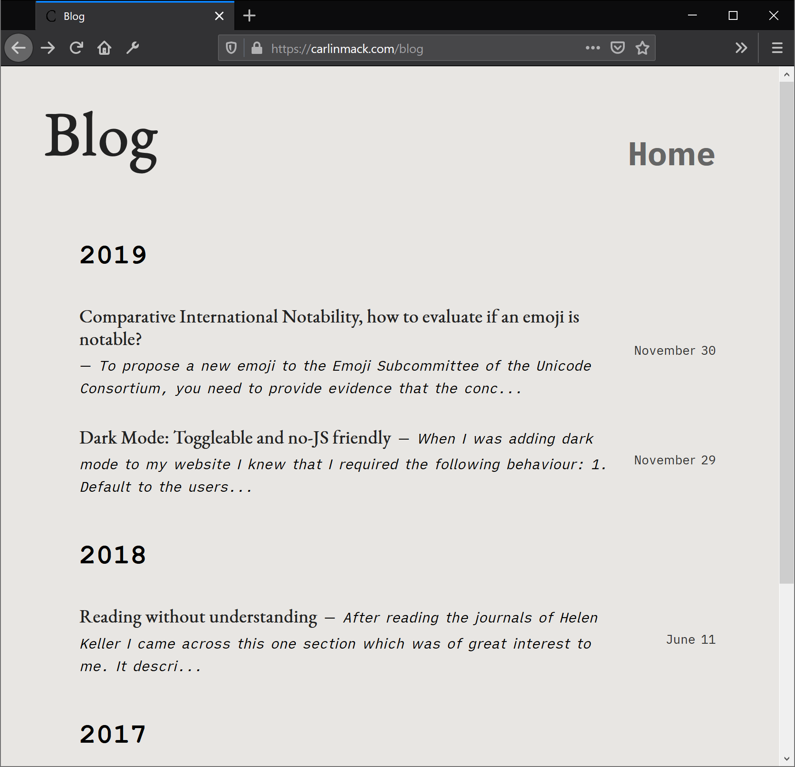

# Ezium

A simple blog theme that merges the style of [Ezhil](https://github.com/vividvilla/ezhil) and [Lithium](https://github.com/jrutheiser/hugo-lithium-theme)

## Demo

[View demo](https://carlinmack.com/blog/)




## Features

* Clean and minimal
* Dark mode - respects user preference and toggleable
* Responsive
* Supports tags
* Syntax highlighting
* Hugo RSS feeds

## Installation

From your Hugo site run the following.

```sh
cd themes
git clone https://github.com/carlinmack/ezium.git
```

For more information read the [official setup guide](https://gohugo.io/overview/installing/) of Hugo.

## Configuration

Many configuration features of Ezhil will work but be prepared to dig into the code if they don't. I'm not planning to support features like social media links etc.

```toml
baseURL = "https://example.com/"
languageCode = "en-us"
title = "My personal blog"
theme = "ezium"

```
## Credits

* [Ezhil](https://github.com/vividvilla/ezhil) - MIT License
* [Lithium](https://github.com/jrutheiser/hugo-lithium-theme) - MIT License
* [iA Writer Quattro](https://github.com/iaolo/iA-Fonts) - Open Font License
* [Spectral](https://fonts.google.com/specimen/Spectral) - Open Font License